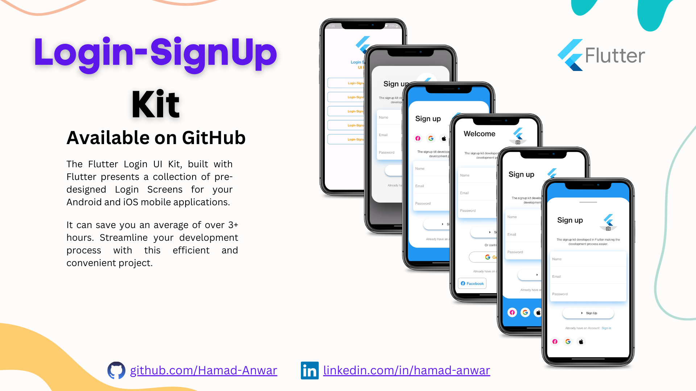

# The Flutter Login UI Kit

The Flutter Login UI Kit is a versatile collection of pre-designed login screens crafted with Flutter, suitable for both Android and iOS app experiences. It covers various login methods, from classic email and password logins to social media authentication, making it perfect for a wide range of app types. With responsive layouts, intuitive navigation, and robust security, this UI Kit enhances usability and simplifies the development process, enabling you to create delightful user experiences.

## Key Features

- Ready-to-use login screens for Android and iOS apps.
- Classic email and password login option.
- Social media authentication, such as Google and Facebook login.
- Beautiful and responsive layouts suitable for different device sizes.
- Intuitive navigation and user-friendly design.
- Robust security measures to ensure user data protection.
- Customizable and easily integrable into your Flutter projects.

## Screenshots

## Getting Started

To get started with the Coffee app, follow these steps:

1. **Prerequisites:** Ensure you have Flutter installed on your system. If not, you can install it from the official Flutter website.

2. **Clone the Repository:** Clone this repository to your local machine using the following command:

3. **Install Dependencies:** Navigate to the project directory and install the required dependencies:

4. **Run the App:** Now, you can run the app on your connected device or emulator:

## Contributing

We welcome contributions from the community! If you'd like to contribute to the Coffee app, follow these steps:

1. Fork this repository.

2. Create a new branch for your feature or bug fix.

3. Make your changes and commit them with descriptive commit messages.

4. Push your changes to your forked repository.

5. Create a pull request to the `main` branch of this repository.

We'll review your pull request and merge it if everything looks good!

## Acknowledgements

We would like to thank the Flutter community for their support and contributions.

## Contact

If you have any questions or suggestions regarding the Coffee app, feel free to contact us at rh676838@gmail.com 

---

